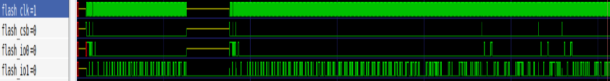

# Caravel_pcb

This git repo describes the whole process of PCB design for the Caravel_Board and verifying/testing the MPW_shuttle chips. <br>

# Verification

<b> Change the paths of `PDK_ROOT`, `PDK`, `GCC_PATH` and `GCC_PREFIX` according to the paths on the system you are working on. </b>

Steps to follow :

```
$ git clone https://github.com/DantuNandiniDevi/Caravel_pcb

$ cd Caravel_pcb/verification/verilog/dv/caravel/mgmt_soc/hkspi

$ export PDK_ROOT=/home/ubuntu/OpenLane/pdks

$ export PDK=sky130A

$ export GCC_PATH=/opt/riscv32/bin

$ export GCC_PREFIX=riscv32-unknown-elf

$ make 

$ gtkwave hkspi.vcd 

$ riscv32-unknown-elf-objdump --disassemble-all hkspi.elf > hkspi.disasm  <This to generate the disassembly file>
``` 

After opening gtkwave we can check multiple signals according to our requirements:

-> The memory address and data signals are at `hkspi_tb -> uut -> soc -> soc -> cpu`. Among the signals at the cpu module <b><I> mem_addr, mem_rdata and mem_wdata </b></I> can be accessed to evaluate the signals.

-> To check the Flash signal flow. We can see flash signals <b><I> flash_clk, flash_csb, flash_i0 and flash_i1  </b></I> at every level of the modules and also in the spiflash module.

# Firmware - Asmita/Aman/Ayyappa
- C code written(which gets concerted to hex along with bootcode) /flowchart in ppt/
- explanation of header file included in the C code (relating it to the efabless caravel documentation)
- C code sent to caravel through the python script through housekeeping flash
- explanation of the python script - caravel_hkflash.py /flowchart in ppt/


# Host to FT232 & FT232 to Host - Nandini/Oishi/Nisha

# Flash Working - Saketh/Yathin/Raj
Waveforms at flash pins of caravel

Waveforms at pins of spi flash


# Bootcode Understanding - Mayank/Yashwant/Prabal

## Reset Flow:


- The reset is triggered exteranlly from outside the caravel chip. This leads to the reset of the
padframe chip_io throught "resetb" which is triggered at exactly 1us.

- Eventually this lead to triggering of reset of various components in management core such as PLL , caravel_ clocking, housekeeping etc. which is also denoted by "resetb" at 1.001us. 

- From caraval_clocking the reset of management_soc is triggered at 1.005us which is denoted by "resetn". 


## Bootcode flow:

The Booting flow during reset and start are almost the same.

- Initializing all the register file from x1 to x31 with value 0, except x2 (Stack pointer) which has been initialized by the reset itself (it is also initiated during start ).

- Copying the initialization value of .data section which involves moving the data from _sidata (start address for the initialization values of the .data section defined in linker script) to between  _sdata and _edata. (start & end address for the .data section defined in linker script respectively).

- Initializing the value present in .bss section (block start symbol) to zero. The .bss section address starts from _sbss to _ebss . 

- Setting the CS (Chip Select) bit HIGH and IO0 as output through SPI control register at address 0x28000000 and enabling manual control of SPI.

- Sending optional WREN command through SPI. These command enable access to files, IO , networking etc

- Once the command have been send the SPI is returned to the previous mode (MEMIO).

NOTE :
- The .data section and .bss section are present in RAM (as described in linker file) with the origin address of 0x01000000.  
- The program code to run after reset and other data are present in the Flash with origin address 0x10000000. 
- The Bootcode is executed using Execute-In-Place (XIP) method.
- Execute-In-Place (XIP) is a method of executing code directly from the serial Flash memory without copying the code to the RAM. The serial Flash memory is seen as another memory in the MCU's memory address map.
- The _sidata of .data section is 0x10000210. which stated as _etext is the diassembly file. 


## Implementation: 

- The reset signal to the padframe "resetb" was activated as 1us. 
 
- This triggered the reset flow till the picorv32 "resetn" which was activated at 1.005us.
 
- The starting address of flash (0x10000000) where the bootcode and rest of the programme are present got loaded in the CPU at 1.009us. 
 
- The instructon present in the (0x10000000) got executed at 1.343us. 
 
- The instruction present in address (0x100000B8) marks the end of bootcode excecution.
 
- The entire bootcode was executed till 6.747us.
 
- The period for which the bootcode ran is approximately 5.738us.

- After that the .main section began to execute which included the firmware and the blink program.

### Start of Bootcode:


### End of Bootcode:


Note: 
In this implementation the WREN command were not transmitted. 

